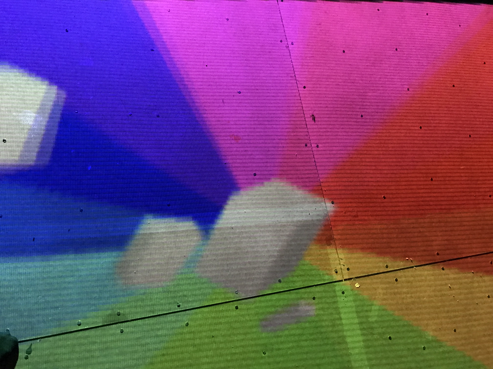
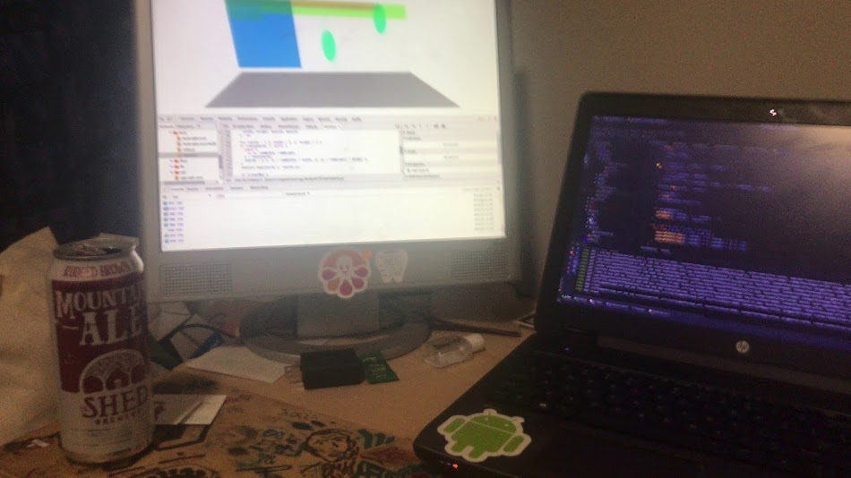

[](https://vimeo.com/248395998)

Interactive installation for [Creative Programming with Jeff Thompson](https://github.com/jeffThompson/CreativeProgramming1/).
Everything is fun and color until reality makes an appearance. Watch the video 👆👆 for the gist of it.

Made with p5.js, OpenCV, and many more.

## Process
Some of the photos from the process of bringing this out of my head. More in [process-images](./process-images).

<div align="center">
<b>At home</b><br>

</div>  <br><br>

<div align="center">
<b>Floor</b><br>

</div>  <br><br>

<div align="center">
<b>During development</b><br>

</div>  

## Dev

### Requirements  
* Node > 8
* OpenCV 2.4

### Running

```bash
# run application in development mode
yarn start:dev

# compile source code and create webpack output
yarn build

# run compiled code on port 8080
yarn start
```
